The bayesian linear regression formulation allows to obtain uncertainty estimates for the predictive distribution that are not available in its point-wise estimate counterpart. This notebook is based on Chapter 3 of Bishop's Pattern Recognition and Machine Learning book.

This notebook can be downloaded [here](/notebooks/bayesianlinearregression.ipynb).

```python
import numpy as np
from scipy.stats import multivariate_normal
import matplotlib.pyplot as plt
%matplotlib inline
```

### Generate sample dataset

Generate N pairs $(x_i,y_i)$ with gaussian noise and $x_i$ sampled from uniform distribution


```python
N = 12
sigma = 0.1
```


```python
x = np.random.uniform(low=-1, high=1, size=N)
n = np.random.normal(loc=0, scale=sigma, size=N)
y = 0.3*x -0.8 +n
```


```python
plt.plot(x,y, 'r.');
plt.show()
```


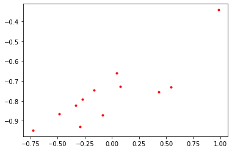


## Point estimate

We are trying to design a model $\hat{y} = x w_1 + w_0 + \epsilon$ with $\epsilon \sim N(0, \sigma^2)$

Note that this model and noise assumption result in the following likelihood function: $$p(\hat{y}|x,w) = N(xw_1+w_0, \sigma)$$

In general we aim for the Lease Squares (LS) solution: $$\min_w \sum_i (y_i-\hat{y}_i)^2$$

Note that the LS solution is equivalent to the Maximum Likelihood Estimator. The solution can be obtained through minimizing the loss function through Gradient Descent. However, in the case of this simple linear model it is possible to use normal equations (closed form minimization result): $$\hat{w} = (X^TX)^{-1}X^Ty$$


```python
X = np.zeros((x.shape[0], 2))
X[:,0] = x
X[:,1] = 1
X
```


    array([[ 0.07747538,  1.        ],
           [-0.72983355,  1.        ],
           [-0.08385175,  1.        ],
           [ 0.04152017,  1.        ],
           [-0.27236207,  1.        ],
           [-0.16471106,  1.        ],
           [ 0.43409736,  1.        ],
           [-0.33582112,  1.        ],
           [-0.48323886,  1.        ],
           [ 0.54369188,  1.        ],
           [-0.29194542,  1.        ],
           [ 0.98406384,  1.        ]])


```python
w = np.dot(np.dot(np.linalg.inv(np.dot(X.T,X)), X.T), y)
w
```


    array([ 0.28106915, -0.75913605])


However, this solution only provides a point estimate and lacks uncertainity information.

## Bayesian inference

In turn, a bayesian approach treat $w$ as a RV which has a prior. Then, bayesian inference is used to obtain the posterior $p(w|X,Y)$ given observations

In order to keep the solutions in closed-form, we use a Gaussian prior, allowing for a conjugate prior, for the vector $w$ $$w \sim N(w| m_0, S_0)$$ 

Which then results in a Gaussian posterior

$$p(w|X,Y) = \frac{p(Y|X,w)p(w)}{p(Y|X)} = N(w| m_N, S_N)$$ where $m_N = S_N (S_0^{-1}m_0+\frac{1}{\sigma}X^Ty)$ and $S_N^{-1} = S_0^{-1}+\frac{1}{\sigma}X^TX$

For simplicity, let's assume $m_0 = 0$ and $S_0 = \alpha^{-1}I = 0.5I$


```python
#prior parameters
a = 0.2
m0 = np.zeros(2)
```


```python
def getPosterior(n):
    #Get n points from sample dataset
    x_ = X[:n]
    y_ = y[:n]
    
    #Covariance Matrix
    S0I = a*np.identity(2)
    SnI = S0I+ 1/sigma*np.dot(x_.T,x_)
    Sn = np.linalg.inv(SnI)
    
    #Mean
    tt = np.dot(S0I, m0) + 1/sigma*np.dot(x_.T,y_)
    Mn = np.dot(Sn, tt)
    return multivariate_normal(mean=Mn, cov=Sn)
```


```python
def plot_dist2D(dist):
    x, y = np.mgrid[-1:1:.01, -1:1:.01]
    pos = np.empty(x.shape + (2,))
    pos[:, :, 0] = y; pos[:, :, 1] = x
    plt.contourf(x, y, dist.pdf(pos))
    plt.title('Posterior Distribution $p(w|X,Y)$')
    plt.xlabel('w0')
    plt.ylabel('w1')
```

#### Posterior distribution plots

We can plot the posterior after aggregating different number of points. Observe how the posterior distributions become narrower when more observation are aggregated


```python
plot_dist2D(getPosterior(1))
```


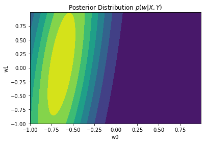


```python
plot_dist2D(getPosterior(4))
```


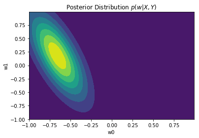


```python
plot_dist2D(getPosterior(6))
```


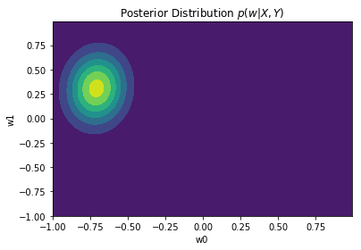


```python
plot_dist2D(getPosterior(10))
```


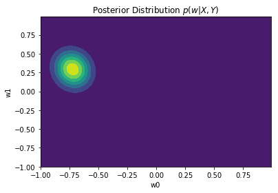


The full posterior (when all points are incorporated) will have a peak on the mean, $w_{MAP} = m_N$, given the Gaussian distribution. In the case where the prior $p(w)$ is infinitely spread ($a \to 0$), $w_{MAP} = m_N = w_{ML} = (X^TX)^{-1}X^Ty$

#### The predictive distribution

Although we have estimated the posterior of parameters $w$, we are primarily interested in predicting the value of $\hat{y}$ for new sample x: $$p(\hat{y}| x, X,Y) = \int p(y|w)p(w|X,Y) dw$$

Given the likelihood and posterior following Gaussian distributions, this predicitive distribution is also Gaussian: $$p(\hat{y}| x, X,Y) = N(\hat{y}| m_N^Tx, \sigma_N^2(x))$$ where $ \sigma_N^2(x) = \sigma^2 + x^TS_Nx $

Note that the variance of the predictive distribution depends both on the assumed noise model ($\sigma$) and the uncertainty on the $w$ posterior


```python
def predictive(x, nTrainingSamples):
    xp = np.zeros((2,1))
    xp[0,0] = x
    xp[1,0] = 1
    xp = np.matrix(xp)
    
    #Get posterior given nTrainingSamples
    posterior = getPosterior(nTrainingSamples)
    Mn = np.matrix(posterior.mean)
    Sn = np.matrix(posterior.cov)
    
    #Predictive mean   
    m = np.matmul(Mn,xp)
    
    #Predictive cov
    s = sigma**2 + np.dot(xp.T, np.dot(Sn,xp))
    return multivariate_normal(mean=m, cov=s)    
```


```python
def plot_dist1D(dist):
    x = np.linspace(-4,4, 100)
    y = dist.pdf(x)
    plt.plot(y,x)
    plt.title('Predictive Distribution $p(\hat{y}|x, X,Y)$')
    plt.xlabel('pdf')
    plt.ylabel('$\hat{y}$')
```

#### We now observe how the predictive distributions become more certain as more training data is obtained


```python
#New values of x where we want to predict y
x = 1.2
```


```python
plot_dist1D(predictive(x, 2))
```


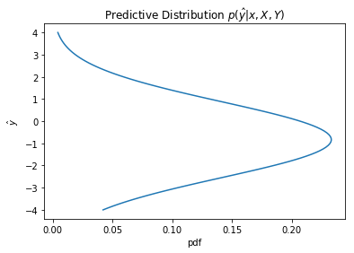


```python
plot_dist1D(predictive(x, 6))
```


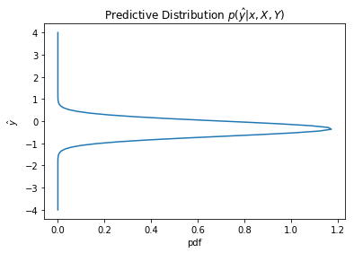


```python
plot_dist1D(predictive(x, 12))
```


#### We would also observe how the uncertainity changes with the values of x


```python
plot_dist1D(predictive(1.2, 12))
```


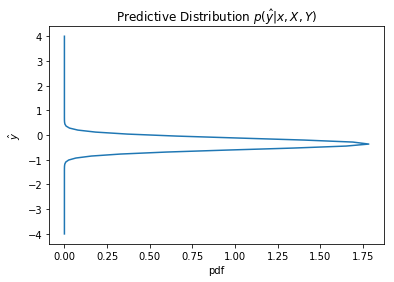


```python
plot_dist1D(predictive(2, 12))
```


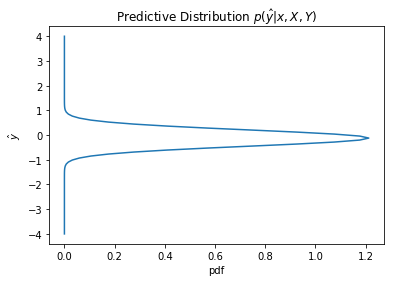


```python
plot_dist1D(predictive(3, 12))
```


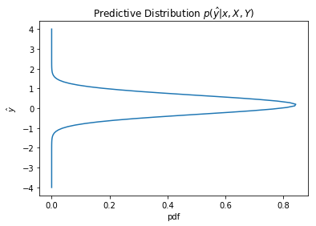


```python
plot_dist1D(predictive(6, 12))
```


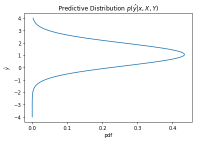


The predictive distribution variance grows as x increases, as expected from $\sigma_N(x)$
